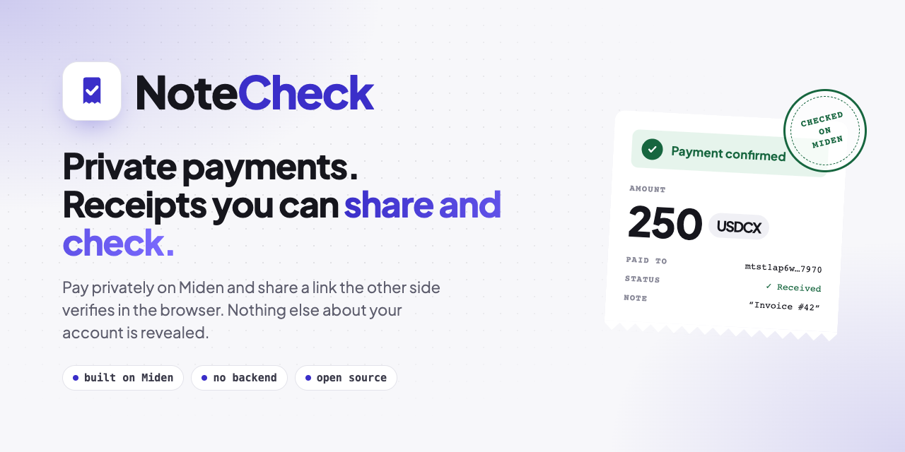
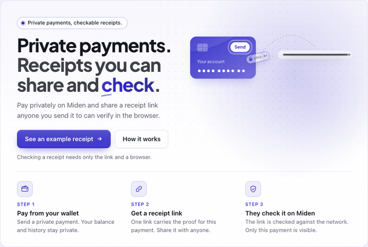
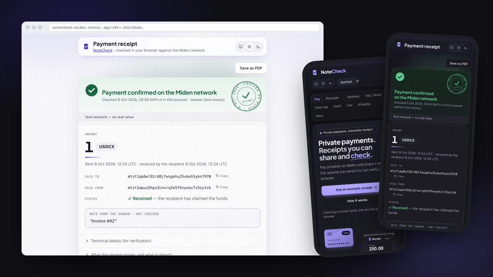
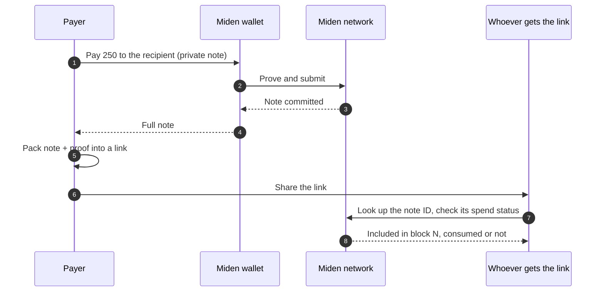
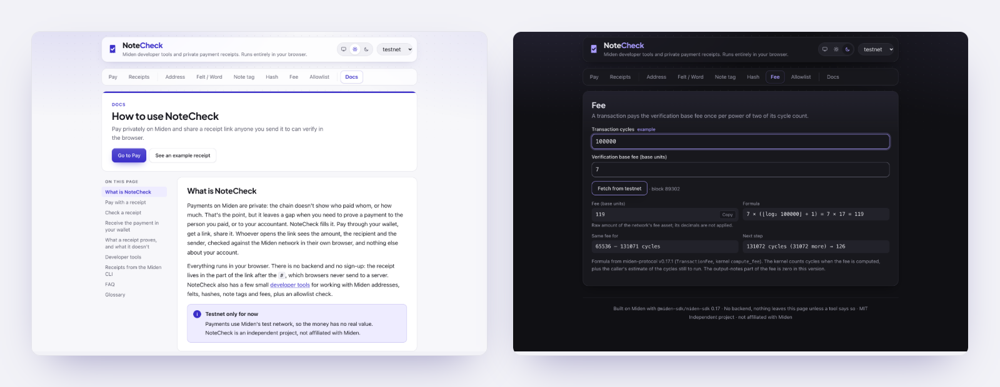

<p align="center">
  
</p>

<p align="center">
  <a href="https://notecheck-miden.vercel.app"><b>Open NoteCheck</b></a> ·
  <a href="https://notecheck-miden.vercel.app/?tool=docs">Docs</a> ·
  <a href="#how-a-receipt-works">How it works</a> ·
  <a href="#running-it">Run locally</a>
</p>

<p align="center">
  
  
  
  
</p>

---

Miden payments are private: the chain doesn't show who paid whom or how much. That's the point, but it leaves a gap when you need to prove a payment to the person you paid, or to your accountant.

**NoteCheck fills it.** Pay through your wallet, get a link, share it. Whoever opens the link sees the amount, the recipient and the sender, checked against the Miden network in their own browser, and nothing else about your account.

<p align="center">
  
</p>

<p align="center">
  
</p>

## What's inside

| | |
|---|---|
| **Pay with a receipt** | Send a private payment from the Miden wallet. When it's on chain you get a receipt link, optionally password-protected. |
| **Receipt page** | A plain-language check anyone can read: amount, paid to, paid from, whether the recipient has claimed it. Save it as a PDF. |
| **Receive** | The recipient's wallet gets the note privately; if it doesn't arrive, they can import it from the receipt. |
| **Developer tools** | Address and account ID decoder, felt and word conversion, Poseidon2 and RPO256 hashing, note tag and fee calculators, allowlist check. |
| **Docs** | A built-in guide, FAQ and glossary. |

Everything runs in the browser. There is no backend; the receipt lives in the link's `#fragment`, which browsers never send to a server.

> Testnet only for now. Independent project, not affiliated with Miden.

## How a receipt works



When you pay from the Pay tab, your wallet sends a private P2ID note to the recipient. NoteCheck takes the full note from the wallet, waits until it is committed, and packs it with the node's inclusion proof into a link:

```
https://<site>/r#r1.<base64url(gzip(json))>
```

The JSON holds the serialized note file plus an optional memo and date. With a password the payload is encrypted (PBKDF2-SHA256, 600k iterations, AES-256-GCM) and the link starts with `r1e.`; send the password separately.

Opening the link:

1. decodes the note file and recomputes the note ID from its contents,
2. asks a Miden node for that note ID and compares the sender, tag and note type it reports,
3. asks whether the note's nullifier has been published, i.e. whether it was consumed.

Changing the amount or the recipient changes the note ID, so an edited receipt won't match anything on chain.

<table>
<tr>
<td valign="top" width="50%">

**What a receipt proves**

- These assets were sent as a note to this recipient account, by this sender account.
- The note was committed to the network, in a given block.
- Whether the note has been consumed, and when.

</td>
<td valign="top" width="50%">

**What it doesn't prove**

- Who consumed it. For P2ID only the recipient can; a P2IDE note can also go back to its sender after a deadline, and the receipt says so.
- Anything else about either account.
- The memo and date: they come from the sender and are shown as such.
- That a payment wasn't presented twice. One payment is one note ID; record it.

</td>
</tr>
</table>

Also worth knowing:

- Checking a receipt asks the Miden node about that note, so the node can link the note to its later spend.
- A receipt link contains the note's details. Only P2ID and P2IDE notes are accepted, because anyone who knows the details of a note without a target check could consume it.
- Token names come from the official Miden token list. A token that isn't in the list, apart from the network's own fee token, is marked unverified, since anyone can create a token with any name.

<p align="center">
  
</p>

## Receipts from the CLI

If you sent a note with the Miden CLI, export it in full format and use the Receipts tab:

```
miden export --note <note-id> --export-type full
```

## Running it

Requires Node 22 or newer and Yarn 1.

```
yarn install
yarn dev        # http://localhost:5173
yarn build      # type check + production build
yarn test       # unit and component tests
```

Browser checks run against a running dev or preview server with your installed Chrome:

```
yarn smoke <base-url>
yarn smoke:extra <base-url>
```

`LIVE=1 yarn test` also runs a few tests against testnet, including a full payment with a local client standing in for the wallet. The images in this README are regenerated with `node brand/readme-assets.mjs` against a running preview.

Built with React, Vite and `@miden-sdk/miden-sdk` 0.17. The wallet connection uses `@miden-sdk/miden-wallet-adapter`.

## License

MIT
